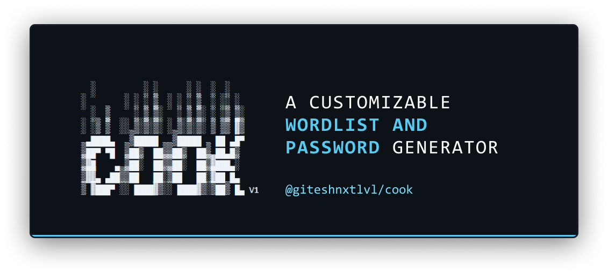
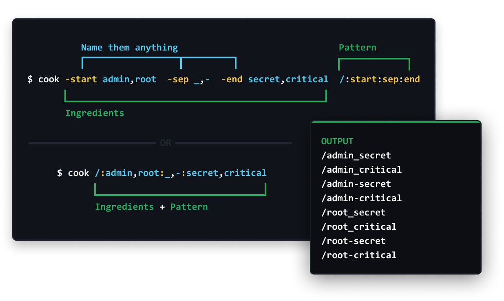
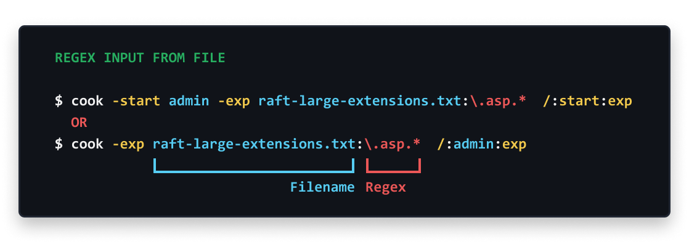
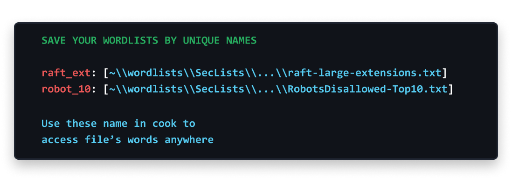
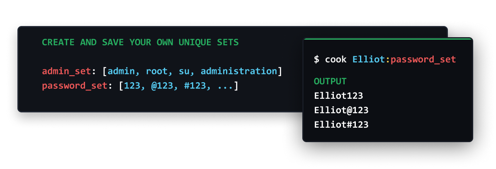
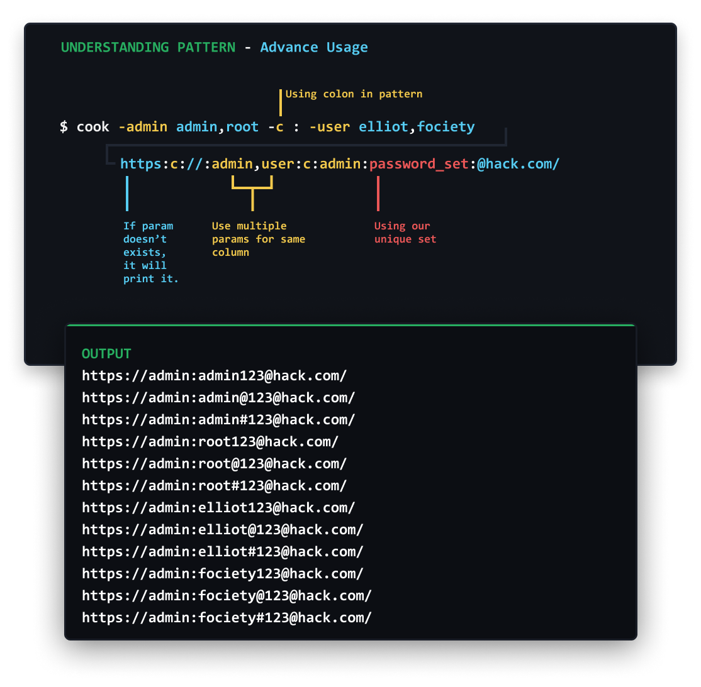

<h1 align="center">COOK</h1>
<h3 align="center">A customizable wordlist and password generator</h3>


- [Summary](#summary)
- [Installation](#installation)
- [Customizing tool](#customizing-tool)
- [Basic Usage](#usage)
- [Predefined Extentions Sets](#predefined-extentions-sets)
- [Using Files](#using-files)
  - [Regex Input from File](#regex-input-from-file)
  - [File Not Found](#regex-input-from-file)
- [Save your wordlists by unique names](#save-wordlists-by-unique-names)
- [Create your own unique words sets](#create-your-own-unique-words-sets)
- [Char-sets : Use it like CRUNCH](#use-it-like-crunch)
- [Advance Usage](#advance-usage)
- [Upcoming Features](#upcoming-features)


## Summary
- Easily create permutations and combinations of words.
- Customize the tools according to your **unique secrets keywords**.   
  To customize the tools you have to modify `cook.yaml`. Check here [Customizing tool](#modifying-cookyaml)
- Easy UX, Checkout examples

## Installation
- Using Go
```
  go get github.com/giteshnxtlvl/cook
```

- Download builds  
  https://github.com/giteshnxtlvl/cook/releases/

## Customizing tool
> Note: You can use above pre-defined sets without modifying anything

1. Download [cook.yaml](https://github.com/giteshnxtlvl/cook/blob/main/cook.yaml)
1. Create an env varirable `COOK` = `Path of file`
3. Done, now tool will use your `cook.yaml`.

## Usage
  ```
    cook -start admin,root  -sep _,-  -end secret,critical  start:sep:end
  ```
  ```
    cook admin,root:_,-:secret,critical
  ```
  



## Predefined Extentions Sets
  - Use `archive` for `.rar, .7z, .zip, .tar,  .tgz, ...`  
  - Use `web` for `.html, .php, .aspx, .js, .jsx, .jsp, ...`
  - Many More...
  - Create your own category in **cook.yaml**

  ### Usage
  Using `archieve` extension set
  ```
   cook -start admin,root  -sep _ -end secret  start:sep:archive
  ```
  ```
   cook admin,root:_:archive
  ```
  


## Using Files
  - Set `file.txt` as param’s value
  - Regex input from `file.txt`:**^apps.***
  - File not found means use filename as value

  ### Regex Input from File  
  You can specify file `-any raft-large-extensions.txt` and can also use regex pattern to extract values like `-exp raft-large-extensions.txt:\.asp.*`
  ```
   cook -start admin -exp raft-large-extensions.txt:\.asp.*  /:start:exp
  ```
  ```
   cook -exp raft-large-extensions.txt:\.asp.*  /:admin:exp
  ```


  ### File not found  
  You can specify file `-any raft-large-extensions.txt` and can also use regex pattern to extract values like `-exp raft-large-extensions.txt:\.asp.*`
  ```
   cook -start admin,root -file file_not_exists.txt start:_:file
  ```
  ```
   cook -file file_not_exists.txt admin,root:_:file
  ```
  Output
  ```
    admin_file_not_exists.txt
    root_file_not_exists.txt
  ```

## Save Wordlists by Unique Names  



## Create your own unique words sets  



## Use it like CRUNCH  


## Advance Usage  




## cook.yaml
This file contains character sets, words's set and extensions set specified.
```yaml


# This is COOK's config file

# Character set like crunch
charSet:
    n     : [0123456789]
    A     : [ABCDEFGHIJKLMNOPQRSTUVWXYZ]
    a     : [abcdefghijklmnopqrstuvwxyz]
    aAn   : [abcdefghijklmnopqrstuvwxyzABCDEFGHIJKLMNOPQRSTUVWXYZ0123456789]
    An    : [ABCDEFGHIJKLMNOPQRSTUVWXYZ0123456789]
    an    : [abcdefghijklmnopqrstuvwxyz0123456789]
    aA    : [abcdefghijklmnopqrstuvwxyzABCDEFGHIJKLMNOPQRSTUVWXYZ]
    s     : ["!#$%&'()*+,-./:;<=>?@[\\]^_` + "`" + `{|}~&\""]
    all   : ["!#$%&'()*+,-./0123456789:;<=>?@ABCDEFGHIJKLMNOPQRSTUVWXYZ[\\]^_` + "`" + `abcdefghijklmnopqrstuvwxyz{|}~\""]

# File to access from anywhere
files:
    raft_ext: [E:\\tools\\wordlists\\SecLists\\Discovery\\Web-Content\\raft-large-extensions.txt]
    robot_1000: [E:\\tools\\wordlists\\SecLists\\Discovery\\Web-Content\\RobotsDisallowed-Top1000.txt]

# Create your word's set
words:
   admin_set: [admin, root, su, administration]
   password_set: [123, "@123", "#123"]

# Extension Set, . will added before using this
extensions:
    archive: [7z, a, apk, xapk, ar, bz2, cab, cpio, deb, dmg, egg, gz, iso, jar, lha, mar, pea, rar, rpm, s7z, shar, tar, tbz2, tgz, tlz, war, whl, xpi, zip, zipx, xz, pak]
    config : [conf, config]
    sheet  : [ods, xls, xlsx, csv, ics vcf]
    exec   : [exe, msi, bin, command, sh, bat, crx]
    code   : [c, cc, class, clj, cpp, cs, cxx, el, go, h, java, lua, m, m4, php, php3, php5, php7, pl, po, py, rb, rs, sh, swift, vb, vcxproj, xcodeproj, xml, diff, patch, js, jsx]
    web    : [html, html5, htm, css, js, jsx, less, scss, wasm, php, php3, php5, php7]
    backup : [bak, backup, backup1, backup2]
    slide  : [ppt, odp]
    font   : [eot, otf, ttf, woff, woff2]
    text   : [doc, docx, ebook, log, md, msg, odt, org, pages, pdf, rtf, rst, tex, txt, wpd, wps]
    audio  : [aac, aiff, ape, au, flac, gsm, it, m3u, m4a, mid, mod, mp3, mpa, pls, ra, s3m, sid, wav, wma, xm]
    book   : [mobi, epub, azw1, azw3, azw4, azw6, azw, cbr, cbz]
    video  : [3g2, 3gp, aaf, asf, avchd, avi, drc, flv, m2v, m4p, m4v, mkv, mng, mov, mp2, mp4, mpe, mpeg, mpg, mpv, mxf, nsv, ogg, ogv, ogm, qt, rm, rmvb, roq, srt, svi, vob, webm, wmv, yuv]
    image  : [3dm, 3ds, max, bmp, dds, gif, jpg, jpeg, png, psd, xcf, tga, thm, tif, tiff, yuv, ai, eps, ps, svg, dwg, dxf, gpx, kml, kmz, webp]
```

## Upcoming Features
- Endpoints Analyser
- Saving Files and Folders in `cook.yaml`

## Resources
- raft-large-extensions.txt : `https://github.com/danielmiessler/SecLists/blob/master/Discovery/Web-Content/raft-large-extensions.txt`
