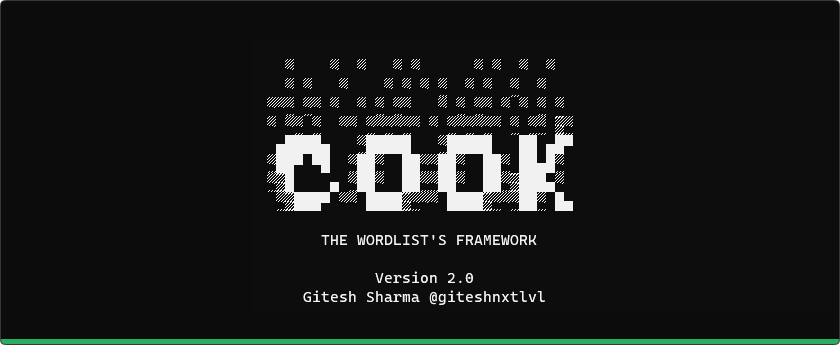
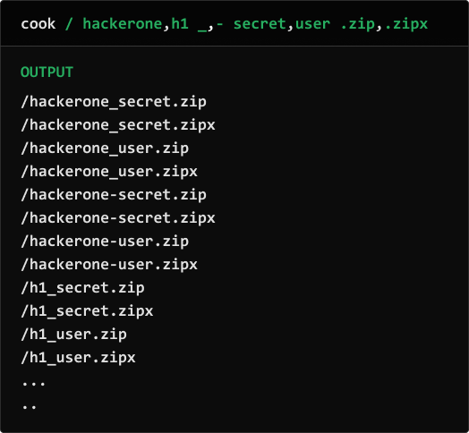
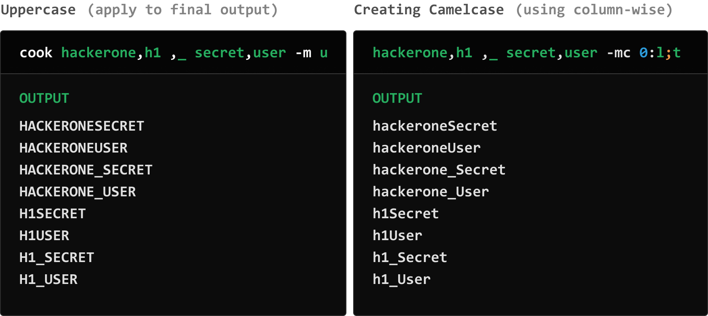
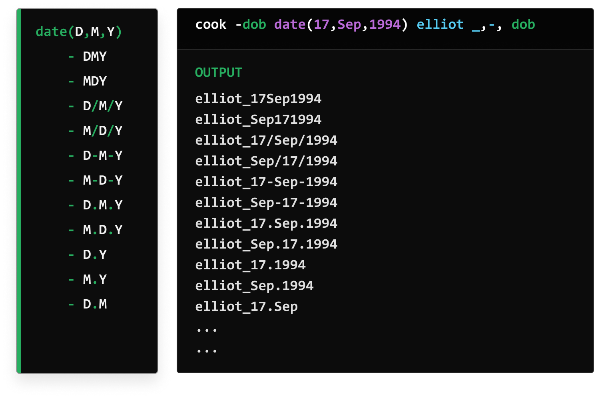
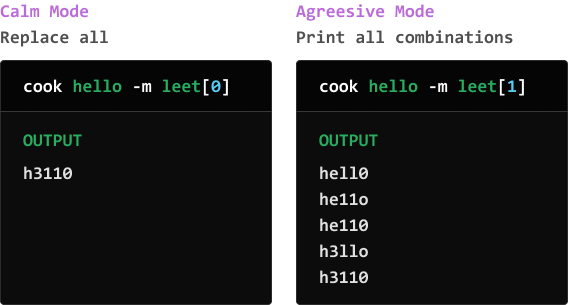
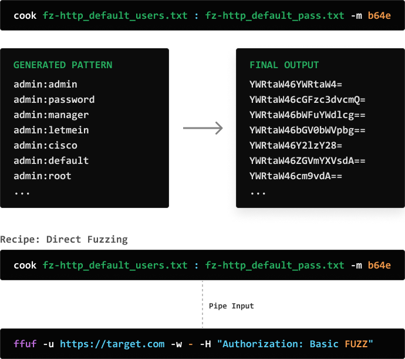
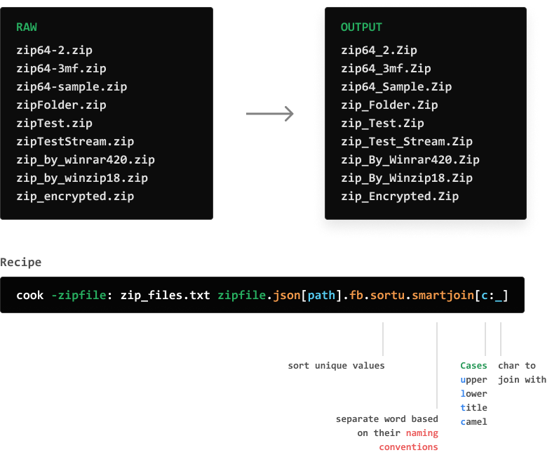

<br>
 

# What is COOK?
Cook is a framework to simplify wordlist generation, modification, updating, searching, and storing them. You can create your unique wordlists, use 5500+ wordlists sets from different repositories, generate complex words permutations & combinations, play with URLs, use pre-defined sets, encode & decode your payloads, integrate with other tools, and much more…
Moreover, everything is customizable.

# Installation
### Using GO
```
go get -u github.com/giteshnxtlvl/cook
```
### Download latest builds  
https://github.com/giteshnxtlvl/cook/releases/
  
# Setup
After installation, run `cook`, it will download [cook-ingredients](https://github.com/giteshnxtlvl/cook-ingredients) at `%USERPROFILE%/cook-ingredients` for windows and `$home/cook-ingredients` for linux.

### Change default location of cook-ingredients
- Create environment variable `COOK=path-of-repo` 

# Parsing Rules
1. **Columns:** Separated by space
1. **Values:** Separated by comma
1. **Params:** Use `-` before anything to make it param. 
1. **Raw Strings:** Use ` before and after the string to stop cook's parsing. Useful when you need to use any keyword as a word.
1. **Pipe Input:** Take pipe input using `-` as value of any param.
1. **File Input:** Use `:` after param name to take file input. `cook -f: live.txt f`


<h1 align="center">Some usage examples</h1>

<h3 align="center"><b>Permutation</b></h3>
<p align="center">
 
</p>

<h3 align="center"><b>Using Methods for cases</b></h3>
<p align="center">
 
</p>

<h3 align="center"><b>Functions</b></h3>
<p align="center">
 
</p>

<h3 align="center"><b>leet method</b></h3>
<p align="center">
 
</p>

 <h3 align="center"><b>Basic Authentication</b></h3>
<p align="center">
 
</p>

<h3 align="center"><b>Smart and smartjoin methods</b></h3>
<p align="center">
 
</p>


# Flags
| Flag | Usage |
|---|---|
|-a, -append| Append to the previous lines, instead of permutations |
|-c, -col| Print column numbers and there values |
|-conf, -config| Config Information |
|-mc, -methodcol| Apply methods column wise  `-mc 0:md5,b64e; 1:reverse` <br> To all cols separate  `-mc md5,b64e` |
|-m, -method| Apply methods to final output |
|-h, -help| Help |
|-min | Minimum no of columns to print |


# Cmds

```
MODES
  Search                     
  Help                       
  Update                     cook update [filename]
                                - Use "cache" to update cached file from source
                                - Use "db" to update cooks-ingredients
                                - Use "*" to do both
  Add                        cook add [values, separated by comma] in [category]
                             (files, raw-files, functions, lists, exts or chars)
                             (This will only make changes in custom.yaml)
  Delete                     cook delete [keyword]
                             (This will only make changes in custom.yaml)
  Show                       cook show [category]
                             Better not try for "files"
```

# Methods
Apply different sets of operations to your wordlists.

- `-m/-method` to apply methods on the final output
- `-mc/-methodcol` to apply column-wise.
- `param.methodname` apply to any parameter-wise, will example this param thing later.
- `param.md5.b64e` apply multiple methods, this will first md5 hash the value and then base64 encode the hashed value.

All Methods
```
METHODS
    Apply different sets of operations to your wordlists

STRING/LIST/JSON
    sort                           - Sort them
    sortu                          - Sort them with unique values only
    reverse                        - Reverse string
    leet                           - a->4, b->8, e->3 ...
                                     leet[0] or leet[1]
    json                           - Extract JSON field
                                     json[key] or json[key:subkey:sub-subkey]
    smart                          - Separate words with naming convensions
                                     redirectUri, redirect_uri, redirect-uri  ->  [redirect, uri]
    smartjoin                      - This will split the words from naming convensions &
                                     param.smartjoin[c,_] (case, join)
                                     redirect-uri, redirectUri, redirect_uri ->  redirect_Uri

    u          upper               - Uppercase
    l          lower               - Lowercase
    t          title               - Titlecase

URLS
    fb         filebase            - Extract filename from path or url
    s          scheme              - Extract http, https, gohper, ws, etc. from URL
               user                - Extract username from url
               pass                - Extract password from url
    h          host                - Extract host from url
    p          port                - Extract port from url
    ph         path                - Extract path from url
    f          fragment            - Extract fragment from url
    q          query               - Extract whole query from url
    k          keys                - Extract keys from url
    v          values              - Extract values from url
    d          domain              - Extract domain from url
               tld                 - Extract tld from url
               alldir              - Extract all dirrectories from url's path
    sub        subdomain           - Extract subdomain from url
               allsubs             - Extract subdomain from url

ENCODERS
    b64e       b64encode           - Base64 encoder
    hexe       hexencode           - Hex string encoder
    jsone      jsonescape          - JSON escape
    urle       urlencode           - URL encode reserved characters
               utf16               - UTF-16 encoder (Little Endian)
               utf16be             - UTF-16 encoder (Big Endian)
    xmle       xmlescape           - XML escape
    urleall    urlencodeall        - URL encode all characters
    unicodee   unicodeencodeall    - Unicode escape string encode (all characters)

DECODERS
    b64d       b64decode           - Base64 decoder
    hexd       hexdecode           - Hex string decoder
    jsonu      jsonunescape        - JSON unescape
    unicoded   unicodedecode       - Unicode escape string decode
    urld       urldecode           - URL decode
    xmlu       xmlunescape         - XML unescape

HASHES
    md5                            - MD5 sum
    sha1                           - SHA1 checksum
    sha224                         - SHA224 checksum
    sha256                         - SHA256 checksum
    sha384                         - SHA384 checksum
    sha512                         - SHA512 checksum
```

## Version 2 and 1 [Breaking Changes]
Version 1.6 and Version 2 have signifant breaking changes to improe the usability of the tool.

- Previously columns was separated with colon. Now they are separated by space
- Single cook.yaml file removed. Now there is folder.
- URL support for yaml file and added sources with over 5500 wordlist sets.
- File regex removed, now use .regex[] method for regex
- Taking file input needs colon after param
- -case flag removed, now you can use upper, lower and title
- Added Methods
- Removed charset and extensions, now they are in list
- Simplyfied ranges