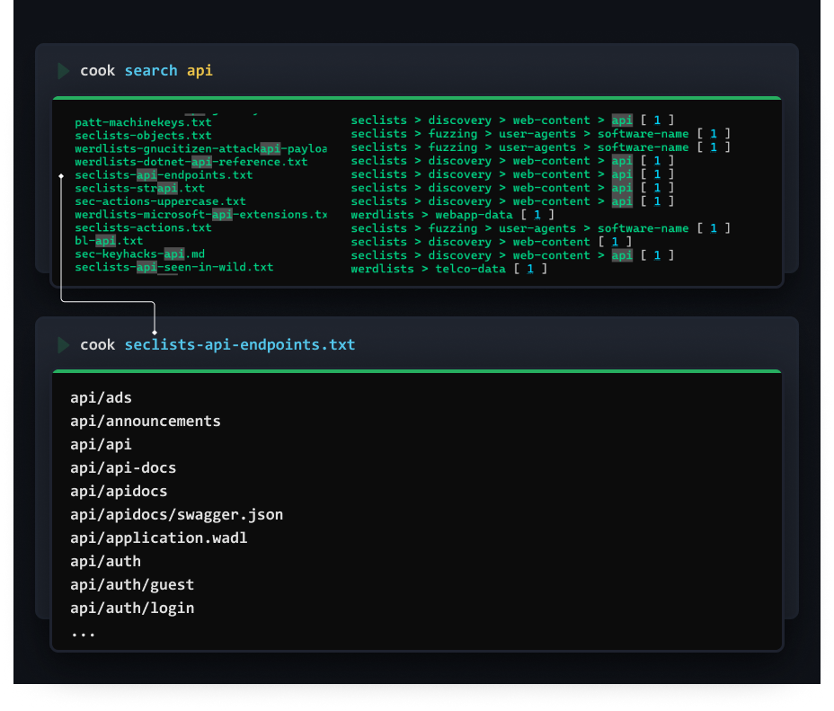
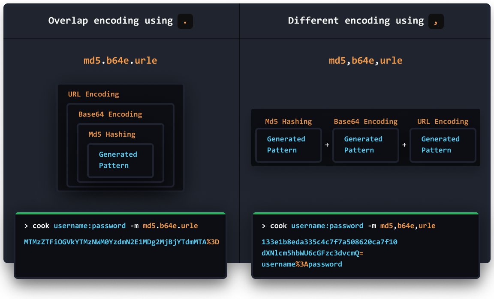
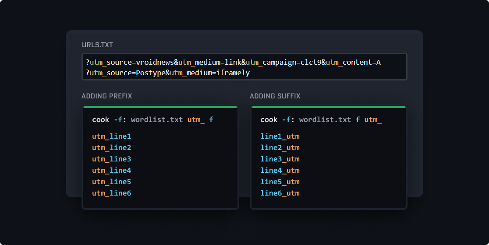

# COOK
An overpower wordlist generator, splitter, merger, finder, saver, create words permutation and combinations, apply different encoding/decoding and everything you need.  

Frustration killer! & Customizable!

# Index
- [Installation](#installation)
    - [Configuration](#configuration)
- [Basic](#basic)
    - [Ranges](#ranges)
    - [Param Approach](#param-approach)
- [COOK's Ingredients](#cooks-ingredients)
    - [Categories](#categories)
    - [Save wordlists/lists/chars everything in `my.yaml`](#save-wordlistslistschars-everything-in-myyaml)
    - [Functions](#functions)
    - [Customize `my.yaml`](#customize-myyaml)   
        [▸ Add/Update](#▸-add/update)   
        [▸ Delete](#▸-delete)   
    - [Local File / Fetch URL](#local-file--fetch-url)
- [Methods](#methods)
    - [Multiple Encoding](#multiple-encoding)
    - [Break naming conventions 💫](#break-naming-conventions-💫)
    - [All methods `cook help methods`](#all-methods-cook-help-methods)
- [Some Usecases Examples](#some-usecases-examples)
    - [Join wordlists line-by-line](#join-wordlists-line-by-line)
    - [Print at every step](#print-at-every-step)
    - [Combine with tools](#combine-with-tools)
- [ULTIMATE USAGE](#ultimate-usage)
    - [Real life usage example:](#real-life-usage-example)
- [Repeat Operator `*` and `**`](#repeat-operator--and)
- [Parsing Rules](#parsing-rules)
- [Flags](#flags)
- [Use as library](#use-as-library)
- [Share your recipies/ingredients in cook-ingredients](#share-your-recipies-and-ingredients-in-cook-ingredients)
- [Contribute](#contribute)


# Installation
Use Go or download [latest builds](https://github.com/glitchedgitz/cook/releases/)  
```
go install -v github.com/glitchedgitz/cook/v2/cmd/cook@latest
```
Archlinux users
```
yay -S cook-framework
```

### Configuration    
From version `v2.2` cook save [cook-ingredients](https://github.com/glitchedgitz/cook-ingredients) at `$home/.config/cook/cook-ingredients`
 
> To change create a path variable name `COOK=[YOUR PATH]`


# Basic

Without basics, everything is complex.


### Ranges


## Param Approach
Name them anything and use them to generate the pattern.
This will be more useful when you apply encoding column-wise using [methods](#methods).

```bash
cook -start intigriti,bugcrowd  -sep _,- -end users.rar,secret.zip  / start sep end
```


```
Note: you must include parameter in the pattern, otherwise it will not print anything. 
```


# COOK's Ingredients
Cook depends on [cook-ingredients](https://github.com/glitchedgitz/cook-ingredients), which are `.yaml` files collections of wordsets, functions, ports, wordlists from [assetnotes](https://wordlists.assetnote.io/), [seclist](https://github.com/danielmiessler/SecLists), [fuzzdb](https://github.com/fuzzdb-project/fuzzdb), `15+` etc.

### Categories
|Category|Description|
|---|---|
| `lists` | Array of values to directly use when called out |
| `files` | Array of urls|
| `ports` | Ranges of numbers|
| `raw-files` | Array of local files|
| `functions` | [Functions](#functions) are used to generate patterns |

## Save wordlists/lists/chars everything in `my.yaml`


### Functions

```
cook -dob date[17,Sep,1994] elliot _,-, dob
```


## Customize `my.yaml`
Edit `my.yaml` manually or use these commands.

#### ▸ Add/Update
If `keyword` doesn't exist it will create it. Otherwise it will update it and add the new value in the same variable.

```
# Syntax
cook add [keyword]=[value1, value2, ..., valueN] in [category]

# Command
cook add unique_name=word1,word2,word3 in lists
```

#### ▸ Delete

```
cook delete [keyword]
```

## Local File / Fetch URL

use `:` after param name.

```
cook -f: live.txt f
```

```
cook -f: https://example.com/wordlist.txt f
```

# Access Wordlists from databases
Cook has fetched multiple repositories and can directly use wordlist from these repos...

[assetnotes](https://wordlists.assetnote.io/), [seclist](https://github.com/danielmiessler/SecLists), [fuzzdb](https://github.com/fuzzdb-project/fuzzdb), etc.




# Methods
Using methods you can encode, decode, reverse, split, sort, extract and can do much more...

Methods can be applied on final output or column-wise

- `-m/-method` to apply methods on the final output
- `-mc/-methodcol` to apply column-wise.
- `param.methodname` apply to any parameter-wise, will example this param thing later.


## Multiple Encoding

- **Overlapping Encodings**:
    - Use dot `.`    
    - `md5.b64e.urle` apply multiple methods one by one.   
    - Output Logic:
        - `Generated Pattern` > `md5 hashing` > `base 64 encoding` > `URL Encoding`.
- **Different Encodings**:     
    - Use comma `,`    
    - `md5,sha1,sha256` apply different encoding to the same generated pattern.    
    - Output Logic:
        - `Generated Pattern` > `md5 hashing`
        - `Generated Pattern` > `sha1 hashing`
        - `Generated Pattern` > `sha256 hashing`



## Break naming conventions 💫
Special focus on these 2 methods, these will be great help everytime you use any wordlist.

### Smart Break `-m smart`

```
▶ cook adminNew,admin_new -m smart
```
```
Output:

admin
New
admin
new
```

### Smart Join `-m smartjoin[<case>:<char>]`
It breaks and join back with the supplied character.
```
▶ cook adminNew,admin-old -m smartjoin[:_]
```
```
Output:

admin_New
admin_old
```
**Apply Cases over separated**

Here we applied camlecase
```
▶ cook suppose_this_is_long_text -m smartjoin[c:_]
```
```
Output:

suppose_This_Is_Long_Text
```


## All methods `cook help methods`

```
sort                           - Sort them
sortu                          - Sort them with unique values only
reverse                        - Reverse string
leet                           - a->4, b->8, e->3 ...
                                    leet[0] or leet[1]

smart                          - Separate words with naming convensions
                                    redirectUri, redirect_uri, redirect-uri  ->  [redirect, uri]
smartjoin                      - This will split the words from naming convensions &
                                    param.smartjoin[c,_] (case, join)
                                    redirect-uri, redirectUri, redirect_uri ->  redirect_Uri

u          upper               - Uppercase
l          lower               - Lowercase
t          title               - Titlecase
```

### String Operations
```
split                          - split[char]
splitindex                     - splitindex[char:index]
replace                        - Replace All replace[this:tothis]
```


### JSON
```
json                           - Extract JSON field
                                    json[key] or json[key:subkey:sub-subkey]
```

### Url Operations
    fb         filebase            - Extract filename from path or url
    s          scheme              - Extract http, https, gohper, ws, etc. from URL
               user                - Extract username from url
               pass                - Extract password from url
    h          host                - Extract host from url
    p          port                - Extract port from url
    ph         path                - Extract path from url
    f          fragment            - Extract fragment from url
    q          query               - Extract whole query from url
    k          keys                - Extract keys from url
    v          values              - Extract values from url
    d          domain              - Extract domain from url
               tld                 - Extract tld from url
               alldir              - Extract all dirrectories from url's path
    sub        subdomain           - Extract subdomain from url
               allsubs             - Extract subdomain from url

### Encode/Decode 
```
b64e       b64encode           - Base64 encode
b64d       b64decode           - Base64 decode

           charcode            - Give charcode encoding
                                    - charcode[0]
                                        &#97&#98&#99 
                                    - charcode[1] with semicolon 
                                        &#97;&#98;&#99;

hexe       hexencode           - Hex string encode
hexd       hexdecode           - Hex string decode

jsone      jsonescape          - JSON escape
jsonu      jsonunescape        - JSON unescape

urle       urlencode           - URL encode reserved characters
            utf16                - UTF-16 encoder (Little Endian)
            utf16be              - UTF-16 encoder (Big Endian)
urld       urldecode           - URL decode
urleall    urlencodeall        - URL encode all characters

xmle       xmlescape           - XML escape
xmlu       xmlunescape         - XML unescape

unicodee   unicodeencodeall    - Unicode escape string encode (all characters)
unicoded   unicodedecode       - Unicode escape string decode
```


### HASHES
```
md5                            - MD5 sum
sha1                           - SHA1 checksum
sha224                         - SHA224 checksum
sha256                         - SHA256 checksum
sha384                         - SHA384 checksum
sha512                         - SHA512 checksum
```

# Some Usecases Examples 
Some general usecases to grasp understanding of cook.

#### ▸ Sites using custom suffix/preffix?


#### ▸ Join wordlists line-by-line

Use `-append` flag:
```
cook -l: live.txt -p: payloads.txt l / p -append 2
```


```
# Multiple columns    
cook col1 col2 col3 col4 col5 -append 2,5
```

*Note: Sometime is confusing to find index of column, then use `-col`*

#### ▸ Print at every step

If you want to start printing data for each permuation, then use `-min` flag


*Note: Sometime is confusing to find index of column, then use `-col`*


## Combine with tools
Generate pattern and combine with other tools using PIPE.
```
cook [Generated Pattern] | [Any tool with pipe input]
```

#### ▸ Basic Auth Fuzzing with [FFUF](https://github.com/ffuf/ffuf)

```bash
cook usernames_list : passwords_list -m b64e | ffuf -u https://target.com -w - -H "Authorization: Basic FUZZ"
```

#### ▸ Null Payload Fuzzing with FFUF

```bash
cook https://target.com/**100 | ffuf -u FUZZ -w - 
```

#### ▸ Hidden Parameters with [x8](https://github.com/Sh1Yo/x8)

```bash
cook [generated output] | x8 -u https://target.com
```

#### ▸ Live Top level domains with [dnsx](https://github.com/projectdiscovery/dnsx) or [httprobe](https://github.com/tomnomnom/httprobe)

```bash
cook example.com seclists-tlds.txt  | dnsx -v
```

 
# ULTIMATE USAGE
Too overpower? But everyday you came accross weird BB stuff, like a big json file from target? May be you want to extract, join, merge or whatever. You can use cook smartly as per your usecase.

## Real life usage example:
As BBH, we came arross JSON file often. YOu may be you read find wordlist to save in your collection.

Let's say you read this blog about IIS Shortname Vulnerabilities
https://blog.assetnote.io/2020/09/18/finding-hidden-files-folders-iis-bigquery/.

Here [Assetnote](https://www.assetnote.io/) shared [BIG ZIP FILE](https://storage.googleapis.com/zipfilesbq/zipfiles.json), Now you need something that can save this file and you can recall it when you need.


Save it like this..., this will save file in `my.yaml`
```
cook add shub_zip_files=[URL] in files
```
Or manually save in `my.yaml`,
```yaml
shub_zip_files : [https://storage.googleapis.com/zipfilesbq/zipfiles.json]
```
> *Note: cook already saved it in default wordlists, you can use `cook shub_zip_files` to access it*


▸ File contains data like this, but this isn't directly useful.
```json
{"repo_name":"cocowool/RoseCMS","ref":"refs/heads/1","path":"user_guide/_downloads/ELDocs.tmbundle.zip","mode":"33261","id":"f7a11b364ca918379b48ad525798148e7470b6b1"}
{"repo_name":"xuguanfeng/practise","ref":"refs/heads/1","path":"node_modules/selenium-webdriver/node_modules/adm-zip/test/assets/fast.zip","mode":"33188","id":"f4ed17b98c9d7bcd21efc4523ce75fbe2b071d0a"}
{"repo_name":"xuguanfeng/practise","ref":"refs/heads/1","path":"node_modules/selenium-webdriver/node_modules/adm-zip/test/assets/store.zip","mode":"33188","id":"e2add30dc0e3129dc89e20a71abe7314052d0002"}
{"repo_name":"xuguanfeng/practise","ref":"refs/heads/1","path":"node_modules/selenium-webdriver/node_modules/adm-zip/test/assets/ultra.zip","mode":"33188","id":"86a8ec776107c075ce2c7f803472aa97dc25cbf7"}
{"repo_name":"xuguanfeng/practise","ref":"refs/heads/1","path":"node_modules/selenium-webdriver/node_modules/adm-zip/test/assets/normal.zip","mode":"33188","id":"b4602c94ee000ee54c71c9302b9db956b3fd9f0e"}
{"repo_name":"xuguanfeng/practise","ref":"refs/heads/1","path":"node_modules/selenium-webdriver/node_modules/adm-zip/test/assets/fastest.zip","mode":"33188","id":"f4ed17b98c9d7bcd21efc4523ce75fbe2b071d0a"}
{"repo_name":"xuguanfeng/practise","ref":"refs/heads/1","path":"node_modules/selenium-webdriver/node_modules/adm-zip/test/assets/maximum.zip","mode":"33188","id":"86a8ec776107c075ce2c7f803472aa97dc25cbf7"}
...
```

**Let say you need to:**   
 ▸ Extract json field `path`  
 ▸ extract `filebase` from `path`    
 ▸ then spliting it based on `naming conventions`

#### Single line solution
 ▸ With cook not just we can extract it, we can extract filebase from path and sort unique, then use smartjoin to create diff permuataions.

```
cook -z shub_zip_files z.json[path].fb.sortu.smartjoin[c:_]
```


And this is also how cook was born, while fuzzing IIS Shortnames and later on I added other features.

# Repeat Operator `*` and `**`
- Use `*` for horizontal repeating.
- Use `**` for vertical repeating.
- And try this `*10-1` or this `*1-10`.


# Parsing Rules
|  |  |
|---|---|
|Columns| Separated by space |
|Values| Separated by comma |
|Params| You can give param any name, use `-` before anything to make it param `-param value` |
|Raw Strings| Use ` before and after the string to stop cook's parsing. Useful when you need to use any keyword as a word. |
|Pipe Input| Take pipe input using `-` as value of any param. |
|File Input| Use `:` after param name to take file input. `cook -f: live.txt f`|
|Functions | Can be called using params only. |
|Methods | Can be used on params or on final output |

# Flags
| Flag | Usage |
|---|---|
|-peek| Peek the output using `-peek 50` for first 50 lines |
|-a, -append| Append to the previous lines, instead of permutations |
|-c, -col| Print column numbers and there values |
|-conf, -config| Config Information |
|-mc, -methodcol| Apply methods column wise  `-mc 0:md5,b64e; 1:reverse` <br> To all cols separate  `-mc md5,b64e` |
|-m, -method| Apply methods to final output |
|-h, -help| Help |
|-min | Minimum no of columns to print |

</details>

# Use as library

```golang
COOK := New(&COOK{
    Pattern: "1-10 .example.com",
})

COOK.Generate()
fmt.Printf("Generated list: %v", COOK.Final)
```

Search the [cook-ingredients](https://github.com/glitchedgitz/cook-ingredients) using library

```golang
COOK := NewWithoutConfig()
results := COOK.Search("api")
fmt.Printf("Searched: %v", results)
```

# Share your recipies and ingredients in [cook-ingredients](https://github.com/glitchedgitz/cook-ingredients)
- Share your yaml file with community

# Contribute
- Use concurrency and make it faster
- Autocomplete for shells
- Make append work something like this `cook file1 =/= file2`, make sure chars directly work with all terminals.
- Making **raw string** works like as it works in programming languages. Means better parser.
- I don't know, you might use your creativity and add some awesome features.
- You can [buy me a coffee](https://www.buymeacoffee.com/glitchedgitz)☕
