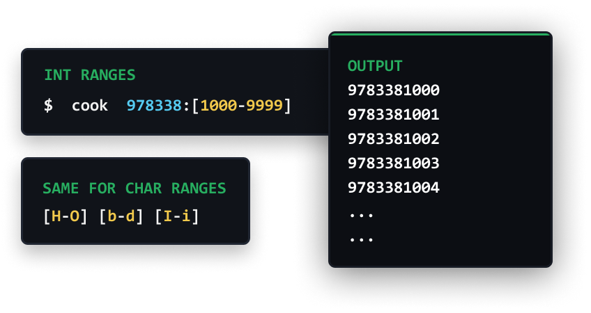
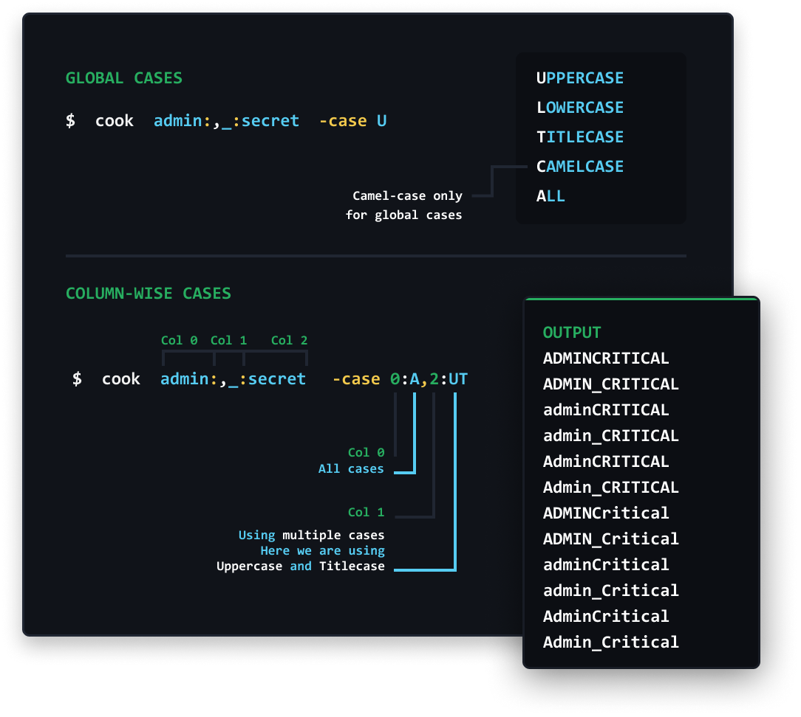

 

<h3 align="center">
<a href="https://twitter.com/giteshnxtlvl"></a>
<a href="https://github.com/giteshnxtlvl/cook/discussions/new"></a>
<a href="https://github.com/giteshnxtlvl/cook/issues/new"></a>
<a href="https://www.buymeacoffee.com/giteshnxtlvl"></a>
</h3>

<h1 align="center">COOK</h1>
<h3 align="center">A customizable wordlist and password generator</h3>
<h4 align="center">Easily create permutations and combinations of words with predefined sets of extensions, words and patterns/function to create complex endpoints, wordlists and passwords. Easy UX, Checkout Usage</h4>


- [Installation](#installation)
- Usage
  - [Basic Permutation](#basic-permutation)
  - [Advance Permutation](#advance-permutation)
  - [Customizing tool](#customizing-tool)
- Predefined Sets
  - [Extension Sets](#predefined-sets)
  - [Words Sets](#create-your-own-unique-sets)
  - [Character sets - Use it like crunch](#use-it-like-crunch)
  - [Patterns/Functions](#patternsfunctions)
  - [Ranges](#ranges)
- Using Files
  - [Regex Input from File](#regex-input-from-file)
  - [File Not Found](#regex-input-from-file)
  - [Save your wordlists by unique names](#save-wordlists-by-unique-names)
- [Cases](#cases)
- [Using COOK with other tools](#using-cook-with-other-tools)
- [Useful Resources](#useful-resources)
- [Contribute](#contribute)
- [Upcoming Features](#upcoming-features)
- [All predefined sets list](#all-sets)

# Installation
#### Using Go
```
  go get github.com/giteshnxtlvl/cook
```
OR
```
  GO111MODULE=on go get github.com/giteshnxtlvl/cook
```
#### Update
```
  go get -u github.com/giteshnxtlvl/cook
```

#### Download latest builds  
  https://github.com/giteshnxtlvl/cook/releases/

# Customizing tool
By customizing you will able to make and use your own lists and patterns/functions.

1. Create empty file named `cook.yaml` *or* Download [cook.yaml](https://github.com/giteshnxtlvl/cook/blob/main/cook.yaml)
1. Create an environment variable `COOK` =`Path of file`  
3. Done, Run `cook -config`
> Note: If you don't want to customize tool, then just don't set `COOK` in env variables.

# Basic Permutation

    
  
  **Recipe**
  ```
    cook -start admin,root  -sep _,-  -end secret,critical  start:sep:end
  ```
  ```
    cook admin,root:_,-:secret,critical
  ```
# Advance Permutation
Understanding concept is important!

  

# Predefined Sets
      
  
  **Recipe**
  ```
   cook -start admin,root  -sep _ -end secret  start:sep:archive
  ```
  ```
   cook admin,root:_:archive
  ```
### Create your own unique sets  
  

### Use it like CRUNCH  
  


# Patterns/Functions

 

**Recipe**
```
  cook -name elliot -birth date(17,Sep,1994) name:birth
```

# Ranges
 

# Files
  ### Regex Input from File  
  
      
  
  **Recipe**
  ```
   cook -exp raft-large-extensions.txt:\.asp.*  /:admin:exp
  ```
  
  ### Save Wordlists by Unique Names  


  ### File not found  
  If file mentioned in param not found, then there will be no errors, instead it will do this
  ```
   cook -file file_not_exists.txt admin,root:_:file
  ```
  ```
    admin_file_not_exists.txt
    root_file_not_exists.txt
  ```

# Cases


# Usefult Resources
Checkout [Resources.md](./Resources.md)
- [Using COOK with other tools]
- [Awesome Wordlists, Tips and Tricks]

# Contribute
- Share your awesome recipes.
- Share useful lists and patterns for COOK.
- Share Ideas or new Feature Request.
- Check out [discussions](https://github.com/giteshnxtlvl/cook/discussions).
- Update [Resources.md](./Resources.md)
  - Add Useful Resources
  - Add tools we can use COOK with.

> Create [discussions](https://github.com/giteshnxtlvl/cook/discussions) for these.

# Support  
If you like the tool, support the development of tool, this will speed up development of [Upcoming Features](#upcoming-features)  

<a href="https://www.buymeacoffee.com/giteshnxtlvl"></a>

# Contributors
- @giteshnxtlvl - Core
- @noraj - Added ffuf command in [Using COOK with other tools](#using-cook-with-other-tools)

# Upcoming Features
- Endpoints Analyser
- Interactive mode for configuring `cook.yaml`

# All Sets
```yaml
# Character set like crunch
charSet:
    sep   : [_- ] #common separators
    n     : [0123456789]
    A     : [ABCDEFGHIJKLMNOPQRSTUVWXYZ]
    a     : [abcdefghijklmnopqrstuvwxyz]
    aAn   : [abcdefghijklmnopqrstuvwxyzABCDEFGHIJKLMNOPQRSTUVWXYZ0123456789]
    An    : [ABCDEFGHIJKLMNOPQRSTUVWXYZ0123456789]
    an    : [abcdefghijklmnopqrstuvwxyz0123456789]
    aA    : [abcdefghijklmnopqrstuvwxyzABCDEFGHIJKLMNOPQRSTUVWXYZ]
    s     : ["!#$%&'()*+,-./:;<=>?@[\\]^_`{|}~&\""]
    all   : ["!#$%&'()*+,-./0123456789:;<=>?@ABCDEFGHIJKLMNOPQRSTUVWXYZ[\\]^_`abcdefghijklmnopqrstuvwxyz{|}~\""]

# File to access from anywhere
files:
    raft_ext     : [E:\tools\wordlists\SecLists\Discovery\Web-Content\raft-large-extensions.txt]
    raft_dir     : [E:\tools\wordlists\SecLists\Discovery\Web-Content\raft-large-directories.txt]
    raft_files   : [E:\tools\wordlists\SecLists\Discovery\Web-Content\raft-large-files.txt]
    robot_1000   : [E:\tools\wordlists\SecLists\Discovery\Web-Content\RobotsDisallowed-Top1000.txt]

# Create your lists
lists:
    schemas      : [aim, callto, cvs, data, facetime, feed, file, ftp, git, gopher, gtalk, h323, hdl, http, https, imap, irc, irc6, ircs, itms, javascript, magnet, mailto, mms, msnim, news, nntp, prospero, rsync, rtsp, rtspu, sftp, shttp, sip, sips, skype, smb, snews, ssh, svn, svn, svn+ssh, telnet, tel, wais, ymsg]
    bypass       : ["%00", "%09", "%0A", "%0D", "%0D%0A"]

    admin_set    : [admin, root, su, superuser, administration]
    api          : [/v1/,/v2/,/v3/,/v4/,/v5/,/api/]
    pass_ends    : [123, "@123", "#123"]

    months       : [January, February, March, April, May, June, July, August, September, October, November, December]
    mons         : [Jan, Feb, Mar, Apr, May, Jun, Jul, Aug, Sep, Oct, Nov, Dec]

# Patterns
patterns:
    date : 
        - date(D,M,Y)
        - DMY  
        - MDY 
        - D/M/Y  
        - M/D/Y 
        - D-M-Y  
        - M-D-Y   
        - D.M.Y  
        - M.D.Y  
        - D.Y  
        - M.Y  
        - D.M

# Extension Set, . will added before using this
extensions:
    config  : [conf, confq, config]
    data    : [xml, json, yaml, yml]
    backup  : [bak, backup, backup1, backup2]
    exec    : [exe, msi, bin, command, sh, bat, crx]
    web     : [html, html5, htm, js, jsx, jsp, wasm, php, php3, php5, php7]
    iis     : [asax, ascx, asmx, aspx, exe, aspx.cs, ashx, axd, config, htm, jar, js, rdl, swf, txt, xls, xml, xsl, zpd, suo, sln]
    archive : [7z, a, apk, xapk, ar, bz2, cab, cpio, deb, dmg, egg, gz, iso, jar, lha, mar, pea, rar, rpm, s7z, shar, tar, tbz2, tgz, tlz, war, whl, xpi, zip, zipx, xz, pak, tar.gz, gz]
    code    : [c, cc, class, clj, cpp, cs, cxx, el, go, h, java, lua, m, m4, php, php3, php5, php7, pl, po, py, rb, rs, sh, swift, vb, vcxproj, xcodeproj, xml, diff, patch, js, jsx]

    #Rest
    css_type: [css, less, scss]
    sheet   : [ods, xls, xlsx, csv, ics vcf]
    slide   : [ppt, pptx, odp]
    font    : [eot, otf, ttf, woff, woff2]
    text    : [doc, docx, ebook, log, md, msg, odt, org, pages, pdf, rtf, rst, tex, txt, wpd, wps]
    audio   : [aac, aiff, ape, au, flac, gsm, it, m3u, m4a, mid, mod, mp3, mpa, pls, ra, s3m, sid, wav, wma, xm]
    book    : [mobi, epub, azw1, azw3, azw4, azw6, azw, cbr, cbz]
    video   : [3g2, 3gp, aaf, asf, avchd, avi, drc, flv, m2v, m4p, m4v, mkv, mng, mov, mp2, mp4, mpe, mpeg, mpg, mpv, mxf, nsv, ogg, ogv, ogm, qt, rm, rmvb, roq, srt, svi, vob, webm, wmv, yuv]
    image   : [3dm, 3ds, max, bmp, dds, gif, jpg, jpeg, png, psd, xcf, tga, thm, tif, tiff, yuv, ai, eps, ps, svg, dwg, dxf, gpx, kml, kmz, webp]


```
