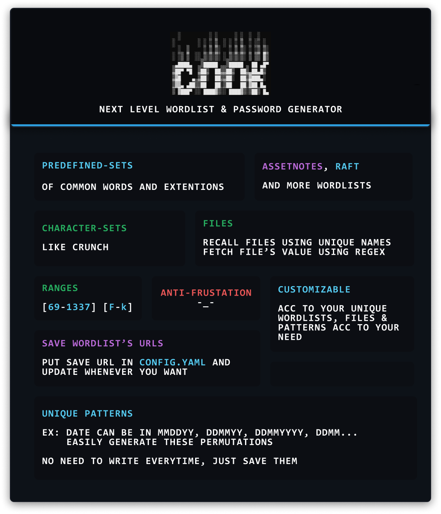
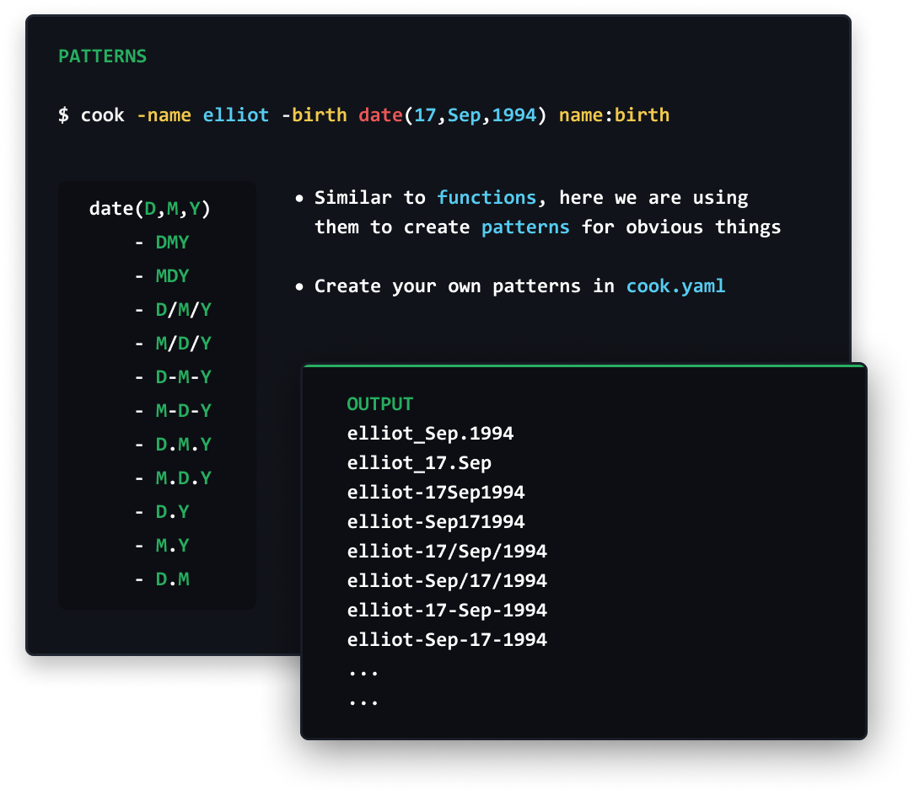

 

# What is COOK?
Next level wordlist and password generator.

# Why?
- Because creating/modifing wordlists are painful and time consuming process.
- Every target is fking uniq and we need to modify our wordlist according to it...
- And we have literaly too many wordlist out there, that managment and updating them is another problem.
- We all have custom wordlists.

# Features
<div>
  <div>✔ <a href="#installation">Pre-defined Sets </a></div>
  <div>✔ <a href="#installation">Wordlist URL</a></div>
  <div>✔ <a href="#installation">Charsets like crunch </a></div>
  <div>✔ <a href="#installation">Ranges [69-1337] [F-k]</a></div>
  <div>✔ <a href="#installation">1337 Mode  </a></div>
  <div>✔ <a href="#installation">Assetnotes Wordlists </a></div>
  <div>✔ <a href="#installation">Seclists Wordlists </a></div>
  <div>✔ <a href="#installation">Files Regex</a></div>
  <div>✔ <a href="#installation">Update wordlists   </a></div>
  <div>✔ <a href="#installation">Clean Wordlists </a></div>
  <div>✔ <a href="#installation">Url analyser</a></div>
  <div>✔ <a href="#installation">Customizable</a></div>
</div>

# Patterns/Functions

 

**Recipe**
```
  cook -birth date(17,Sep,1994) elliot _,- birth
```

### Minimum
Use `-min <num>` to print minimum no of columns to print.  
Try this command with -min and without minimum
```
cook n n n -min 1
```

### Pipe input
Use `-` as param value for pipe input
```
cook -pipe - pipe wordlist
```

### Raw String
Use it RAW, param's value with `
```
cook -raw `date(10,12,1999)` raw
```

# Installation
### Using Go
**Install/Update**  
```
go get -u github.com/giteshnxtlvl/cook
```

### Download latest builds  
  https://github.com/giteshnxtlvl/cook/releases/

# Customizing tool

# Todo
-  [ ] Specify start and stop of wordlist

# Final Words 
> *COOKING IS AN ART, ART NEEDS CREATIVITY*    

This tool will not help you find bugs but your creativity does.

