# COOK
An overpower wordlist generator, splitter, merger, finder, saver, create words permutation and combinations, apply different encoding/decoding and everything you need.  

Frustration killer! & Customizable!

### Customizable
Cook is highly customizable and it depends on
[cook-ingredients](https://github.com/glitchedgitz/cook-ingredients). Cook Ingredients consists YAML Collection of word-sets, extensions, funcitons to generate pattern and wordlists.

### Installation
Use Go or download [latest builds](https://github.com/glitchedgitz/cook/releases/)  
```
go install -v github.com/glitchedgitz/cook/v2/cmd/cook@latest
```

> After installation, run `cook` for one time, it will download [cook-ingredients](https://github.com/glitchedgitz/cook-ingredients) automatically at `%USERPROFILE%/cook-ingredients` for windows and `$home/cook-ingredients` for linux.

# Basic
Without basics, everything is useless.
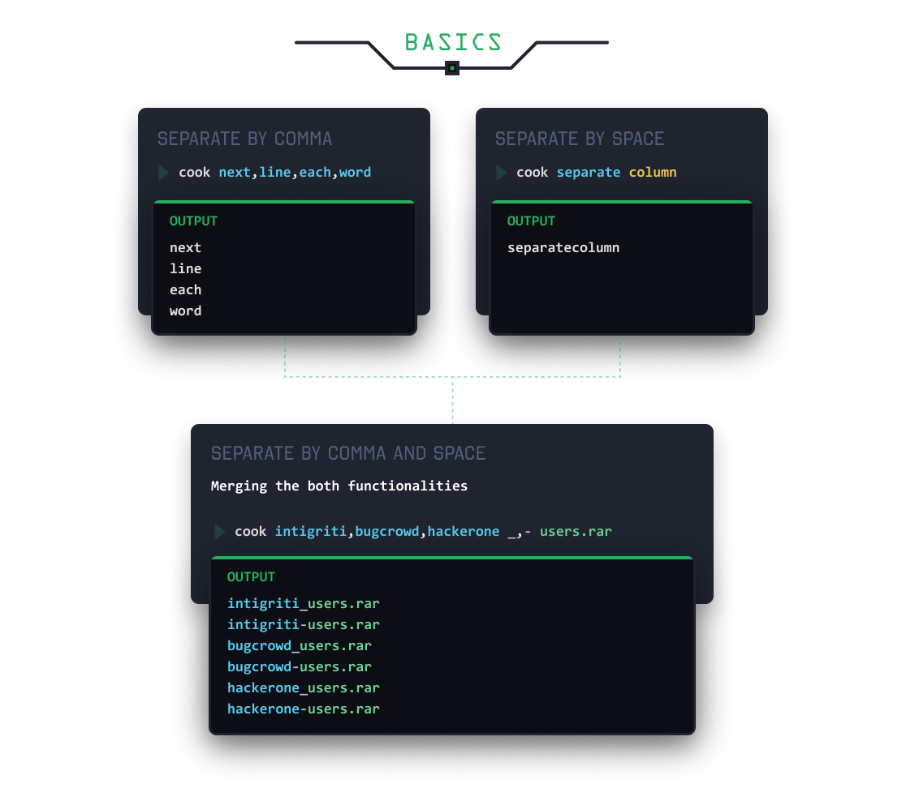

## Parametric Approach
You can define your own params and use them to generate the pattern. This will be useful once you understand [methods](#methods)
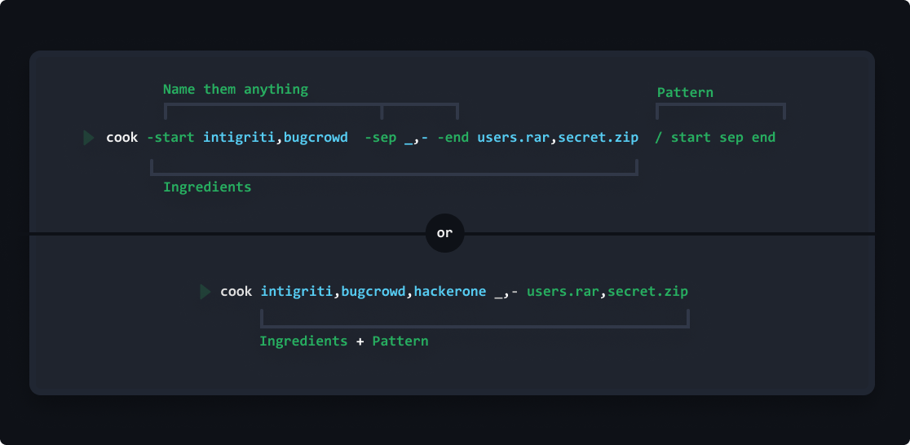

# Save wordlists and word sets
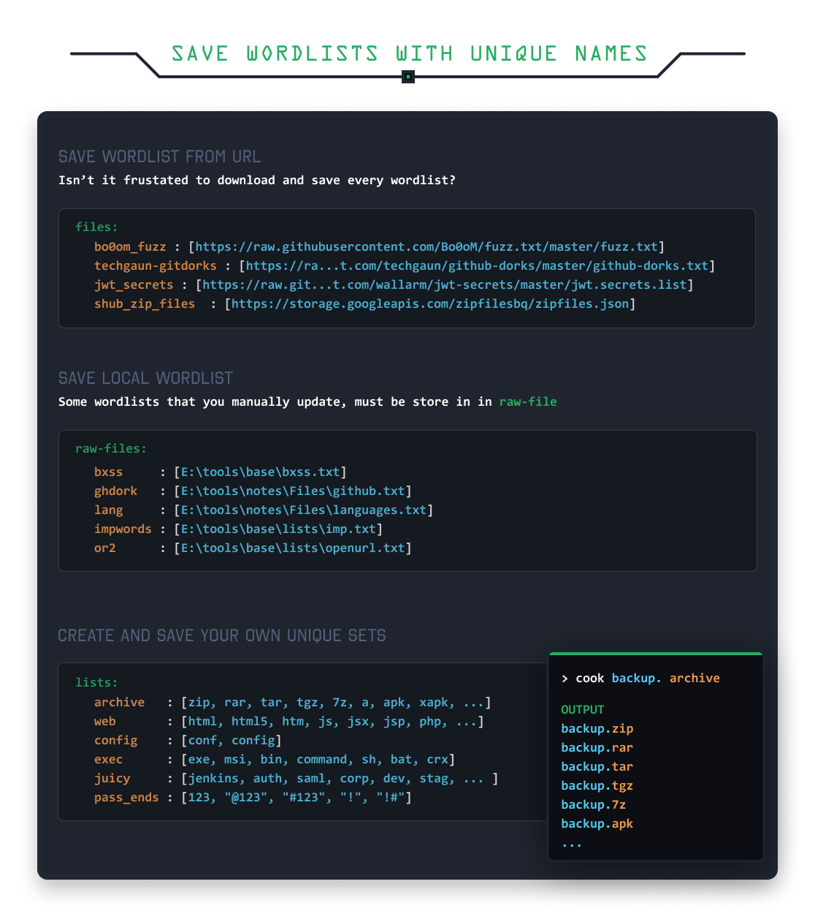

### Search Wordlist
```
cook search keyword
```

## Reading File using Cook
If you want to use a file from current working directory.  
Use `:` after param name. 
```
cook -f: live.txt f
```

# Methods
Methods will let you apply diffenent sets of operation on final output or particular column as you want. You can encode, decode, reverse, split, sort, extract different part of urls and much more...

- `-m/-method` to apply methods on the final output
- `-mc/-methodcol` to apply column-wise.
- `param.methodname` apply to any parameter-wise, will example this param thing later.
- `param.md5.b64e` apply multiple methods, this will first md5 hash the value and then base64 encode the hashed value.

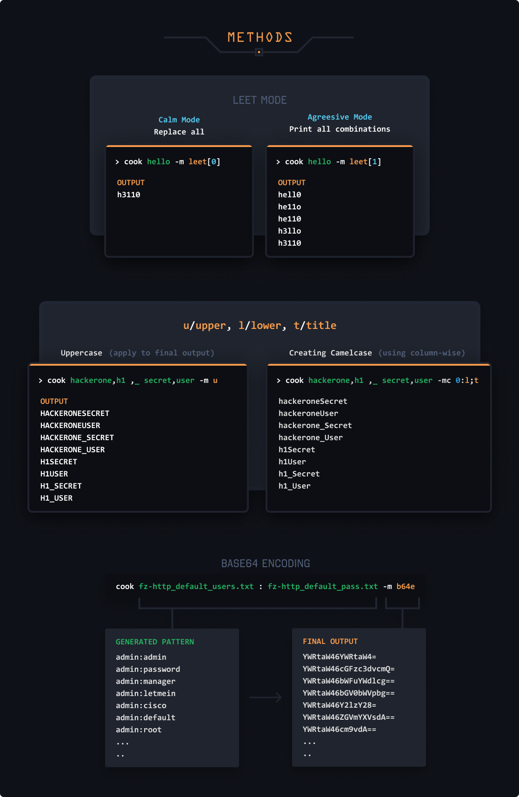
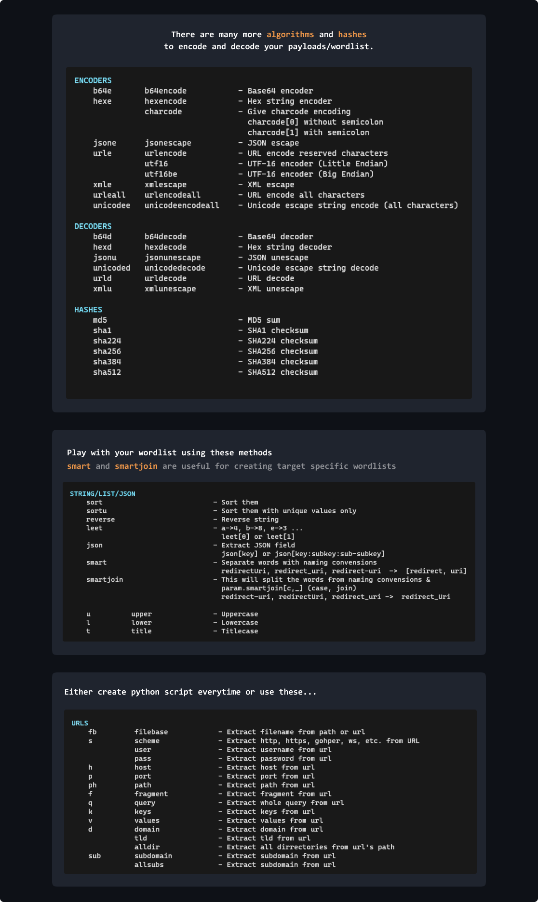

<details><summary>All methods</summary>

```
METHODS
    Apply different sets of operations to your wordlists

STRING/LIST/JSON
    sort                           - Sort them
    sortu                          - Sort them with unique values only
    reverse                        - Reverse string
    split                          - split[char]
    splitindex                     - splitindex[char:index]
    replace                        - Replace All replace[this:tothis]
    leet                           - a->4, b->8, e->3 ...
                                     leet[0] or leet[1]
    json                           - Extract JSON field
                                     json[key] or json[key:subkey:sub-subkey]
    smart                          - Separate words with naming convensions
                                     redirectUri, redirect_uri, redirect-uri  ->  [redirect, uri]
    smartjoin                      - This will split the words from naming convensions &
                                     param.smartjoin[c,_] (case, join)
                                     redirect-uri, redirectUri, redirect_uri ->  redirect_Uri

    u          upper               - Uppercase
    l          lower               - Lowercase
    t          title               - Titlecase

URLS
    fb         filebase            - Extract filename from path or url
    s          scheme              - Extract http, https, gohper, ws, etc. from URL
               user                - Extract username from url
               pass                - Extract password from url
    h          host                - Extract host from url
    p          port                - Extract port from url
    ph         path                - Extract path from url
    f          fragment            - Extract fragment from url
    q          query               - Extract whole query from url
    k          keys                - Extract keys from url
    v          values              - Extract values from url
    d          domain              - Extract domain from url
               tld                 - Extract tld from url
               alldir              - Extract all dirrectories from url's path
    sub        subdomain           - Extract subdomain from url
               allsubs             - Extract subdomain from url

ENCODERS
    b64e       b64encode           - Base64 encoder
    hexe       hexencode           - Hex string encoder
               charcode            - Give charcode encoding
                                     charcode[0] without semicolon
                                     charcode[1] with semicolon
    jsone      jsonescape          - JSON escape
    urle       urlencode           - URL encode reserved characters
               utf16               - UTF-16 encoder (Little Endian)
               utf16be             - UTF-16 encoder (Big Endian)
    xmle       xmlescape           - XML escape
    urleall    urlencodeall        - URL encode all characters
    unicodee   unicodeencodeall    - Unicode escape string encode (all characters)

DECODERS
    b64d       b64decode           - Base64 decoder
    hexd       hexdecode           - Hex string decoder
    jsonu      jsonunescape        - JSON unescape
    unicoded   unicodedecode       - Unicode escape string decode
    urld       urldecode           - URL decode
    xmlu       xmlunescape         - XML unescape

HASHES
    md5                            - MD5 sum
    sha1                           - SHA1 checksum
    sha224                         - SHA224 checksum
    sha256                         - SHA256 checksum
    sha384                         - SHA384 checksum
    sha512                         - SHA512 checksum
  
```
</details>

## Multiple Methods
You can apply multiple set of operations on partiocular column or final output in one command. So you don't have to re-run the tool again and again.

To understanding the usage, suppose you read a blog, consider this one https://blog.assetnote.io/2020/09/18/finding-hidden-files-folders-iis-bigquery/.

```
cook -z shub_zip_files z.json[path].fb.sortu.smartjoin[c:_]
```

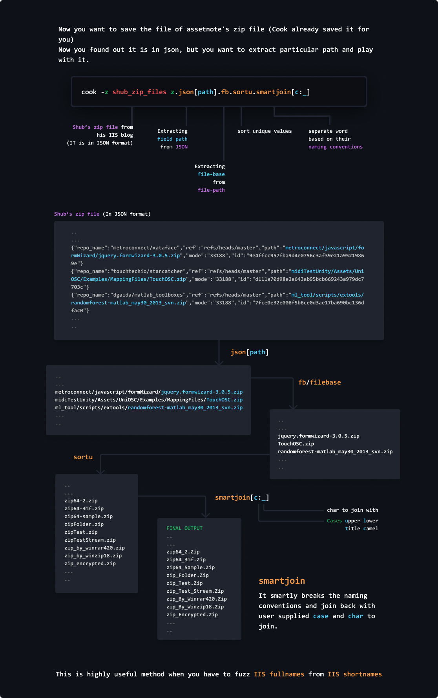

# Direct fuzzing with FUFF
You can use generated output from cook directly with [ffuf](https://github.com/ffuf/ffuf) using pipe

```
cook usernames_list : passwords_list -m b64e | ffuf -u https://target.com -w - -H "Authorization: Basic FUZZ"
```

Similarly you can fuzz directories/headers/params/numeric ids... And can apply required algorithms on your payloads.

# Functions
```
cook -dob date[17,Sep,1994] elliot _,-, dob
```
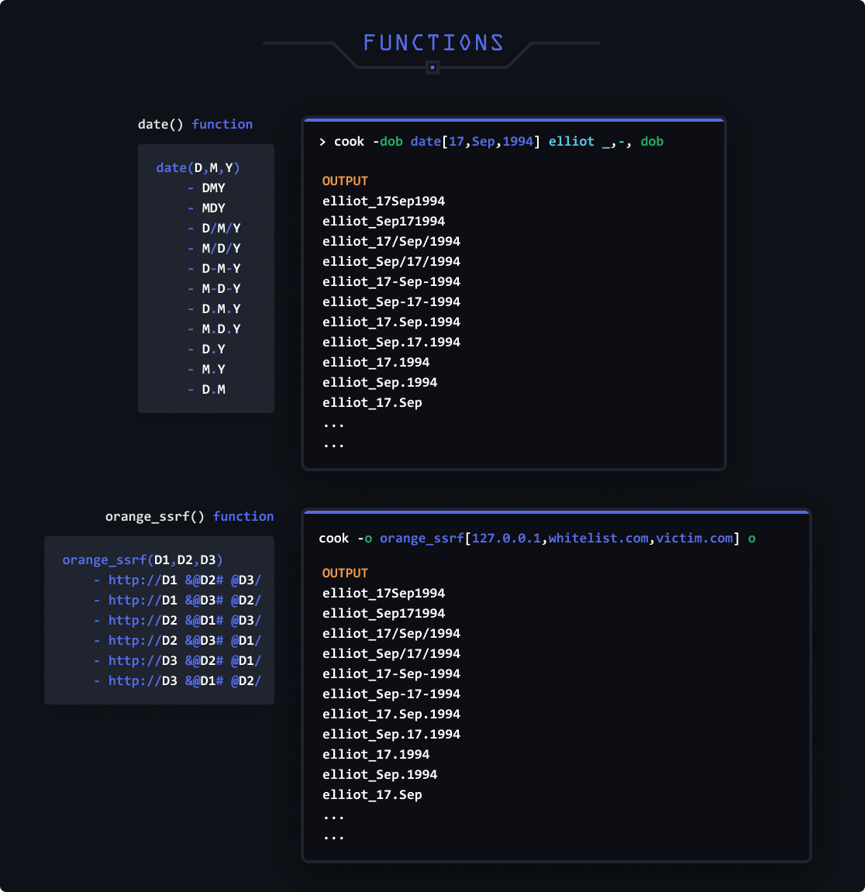

> Customize:    
 Create your own functions in `cook-ingredients/my.yaml` under functions:

# Parsing Rules
|  |  |
|---|---|
|Columns| Separated by space |
|Values| Separated by comma |
|Params| You can give param any name, use `-` before anything to make it param `-param value` |
|Raw Strings| Use ` before and after the string to stop cook's parsing. Useful when you need to use any keyword as a word. |
|Pipe Input| Take pipe input using `-` as value of any param. |
|File Input| Use `:` after param name to take file input. `cook -f: live.txt f`|
|Functions | Can be called using params only. |
|Methods | Can be used on params or on final output |

# Flags
| Flag | Usage |
|---|---|
|-a, -append| Append to the previous lines, instead of permutations |
|-c, -col| Print column numbers and there values |
|-conf, -config| Config Information |
|-mc, -methodcol| Apply methods column wise  `-mc 0:md5,b64e; 1:reverse` <br> To all cols separate  `-mc md5,b64e` |
|-m, -method| Apply methods to final output |
|-h, -help| Help |
|-min | Minimum no of columns to print |

### -append
Append line by line. So basically if you want to merge two lists line by line. Then use it. And as always you can append multiple columns using column
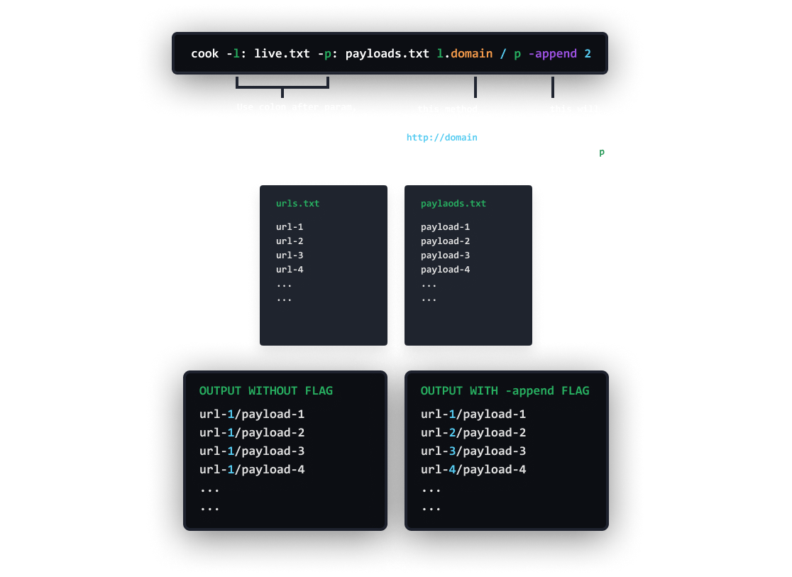 

### -min
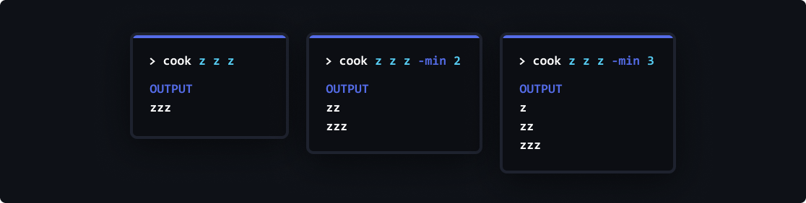

# Ranges
Something useful...
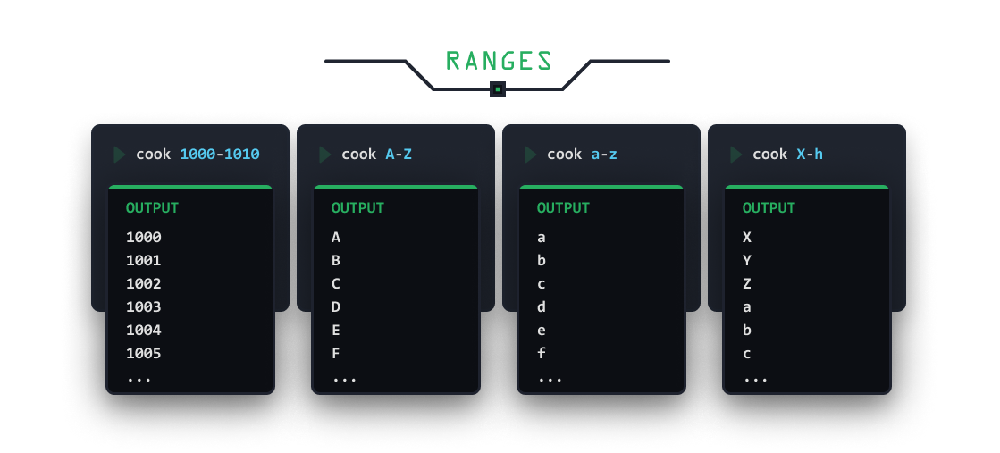

# Repeat Operator
You can repeat a string horizontally or vertically.
- Use `*` for horizontal repeating.
- Use `**` for vertical repeating.
- And try this `*10-1` or this `*1-10`.
- Create Null Payloads and directly fuzz with fuff. `cook **100 | fuff ...`
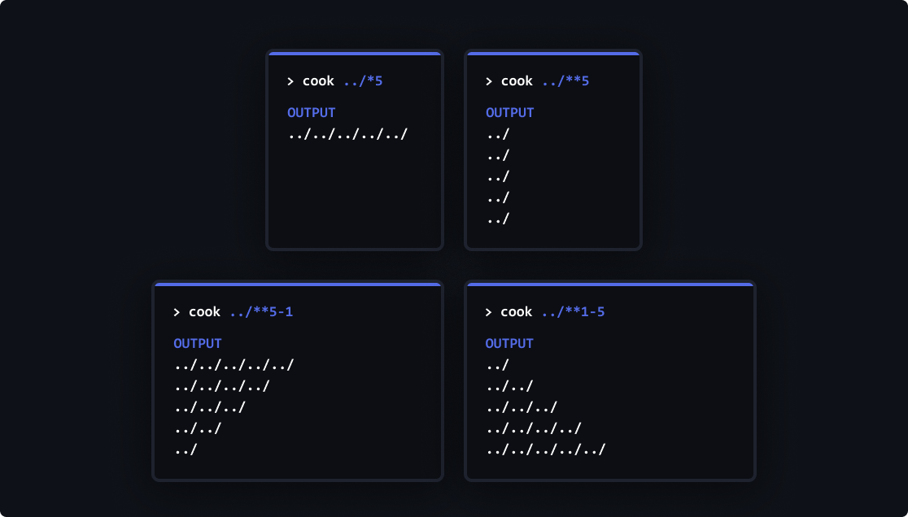

</details>

# Breaking Changes in version v2.x.x
Version 1.6 and Version 2 have signifant breaking changes to improe the usability of the tool.

- Previously columns was separated with colon. Now they are separated by space
- Single cook.yaml file removed. Now there is folder.
- URL support for yaml file and added sources with over 5500 wordlist sets.
- File regex removed, now use .regex[] method for regex
- Taking file input needs colon after param
- -case flag removed, now you can use upper, lower and title
- Added Methods
- Removed charset and extensions, now they are in list
- Simplyfied ranges

# Contribute
- Add wordlists, wordsets, functions, ports and other things in [cook-ingredients](https://github.com/glitchedgitz/cook-ingredients)
- Making **raw string** works like as it works in programming languages. Means better parser.
- I don't know, you might use your creativity and add some awesome features.
Or you can [buy me a coffee](https://www.buymeacoffee.com/glitchedgitz)☕
